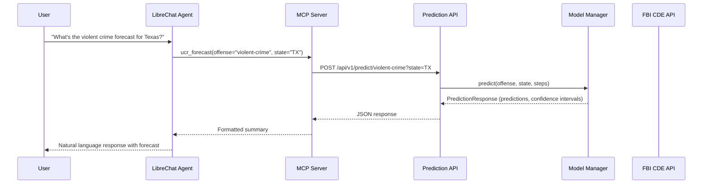
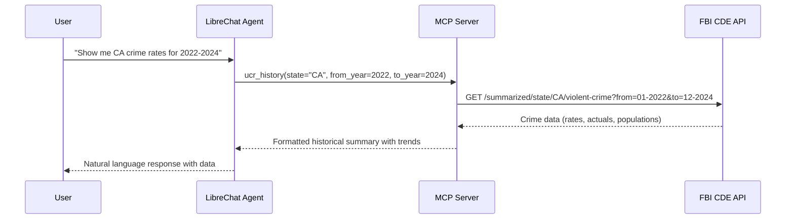
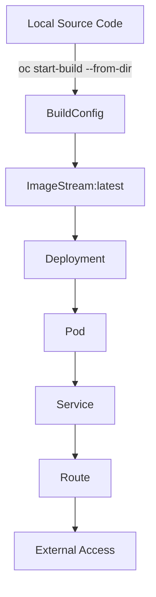

# FBI Crime Stats MCP Server - Architecture

This document describes the system architecture for the FBI Crime Statistics prediction and analysis system, including the predictive models, REST API, MCP server, and agent integration.

## System Topology

```
                                    ┌─────────────────────────────────────┐
                                    │         EXTERNAL DATA SOURCE        │
                                    │   FBI Crime Data Explorer API       │
                                    │   api.usa.gov/crime/fbi/cde         │
                                    │                                     │
                                    │   - /summarized/national/{offense}  │
                                    │   - /summarized/state/{state}/...   │
                                    │   - Monthly crime rates & counts    │
                                    │   - 2015-present historical data    │
                                    └──────────────────┬──────────────────┘
                                                       │
                                                       │ HTTPS (live data)
                                                       ▼
┌──────────────────────────────────────────────────────────────────────────────────────────┐
│                              OPENSHIFT CLUSTER (fbi-ucr namespace)                       │
│                                                                                          │
│  ┌────────────────────────────────────────────────────────────────────────────────────┐  │
│  │                           PREDICTION API SERVICE                                    │  │
│  │                     fbi-ucr-fbi-ucr.apps.cluster-*.opentlc.com                     │  │
│  │                                                                                    │  │
│  │  ┌──────────────────────────────────────────────────────────────────────────────┐  │  │
│  │  │                         FastAPI Application                                   │  │  │
│  │  │                         (fbi_ucr.main:app)                                   │  │  │
│  │  │                                                                              │  │  │
│  │  │   REST Endpoints:                                                            │  │  │
│  │  │   ├── GET  /api/v1/health      → Service health & model status               │  │  │
│  │  │   ├── GET  /api/v1/models      → List available prediction models            │  │  │
│  │  │   ├── POST /api/v1/predict/{offense}  → Generate predictions                 │  │  │
│  │  │   └── GET  /api/v1/history/{offense}  → Fetch historical FBI data            │  │  │
│  │  └──────────────────────────────────────────────────────────────────────────────┘  │  │
│  │                                      │                                             │  │
│  │                                      │ loads on startup                            │  │
│  │                                      ▼                                             │  │
│  │  ┌──────────────────────────────────────────────────────────────────────────────┐  │  │
│  │  │                         MODEL MANAGER                                         │  │  │
│  │  │                     (inference.ModelManager)                                  │  │  │
│  │  │                                                                              │  │  │
│  │  │   ┌────────────────┐  ┌────────────────┐  ┌────────────────┐                 │  │  │
│  │  │   │ Prophet Models │  │ ARIMA Models   │  │ SARIMA Models  │                 │  │  │
│  │  │   │                │  │                │  │                │                 │  │  │
│  │  │   │ - violent-crime│  │ - homicide     │  │ - burglary     │                 │  │  │
│  │  │   │ - property     │  │ - mvt          │  │                │                 │  │  │
│  │  │   │ - state models │  │                │  │                │                 │  │  │
│  │  │   └────────────────┘  └────────────────┘  └────────────────┘                 │  │  │
│  │  │                                                                              │  │  │
│  │  │   Models Directory: /models/*.pkl (serialized trained models)                │  │  │
│  │  │   Training Data: Jan 2020 - Oct 2024 (FBI UCR summarized data)               │  │  │
│  │  │   Supported: National + 5 states (CA, TX, FL, NY, IL)                        │  │  │
│  │  └──────────────────────────────────────────────────────────────────────────────┘  │  │
│  │                                                                                    │  │
│  │  Deployment: deployment/fbi-ucr → service/fbi-ucr → route/fbi-ucr                 │  │
│  │  Port: 8080                                                                        │  │
│  └────────────────────────────────────────────────────────────────────────────────────┘  │
│                                           │                                              │
│                                           │ Internal HTTPS calls                         │
│                                           ▼                                              │
│  ┌────────────────────────────────────────────────────────────────────────────────────┐  │
│  │                             MCP SERVER SERVICE                                      │  │
│  │                    mcp-server-fbi-ucr.apps.cluster-*.opentlc.com                   │  │
│  │                                                                                    │  │
│  │  ┌──────────────────────────────────────────────────────────────────────────────┐  │  │
│  │  │                      FastMCP 2.x Application                                  │  │  │
│  │  │                      (streamable-http transport)                              │  │  │
│  │  │                                                                              │  │  │
│  │  │   MCP Tools:                                                                 │  │  │
│  │  │   ┌──────────────────────────────────────────────────────────────────────┐   │  │  │
│  │  │   │  ucr_forecast                                                        │   │  │  │
│  │  │   │  ├─ Generate crime predictions with confidence intervals             │   │  │  │
│  │  │   │  ├─ Calls: POST /api/v1/predict/{offense}                            │   │  │  │
│  │  │   │  ├─ Supports: national + state-level (CA, TX, FL, NY, IL)            │   │  │  │
│  │  │   │  └─ Output: summary (prose) or detailed (JSON)                       │   │  │  │
│  │  │   ├──────────────────────────────────────────────────────────────────────┤   │  │  │
│  │  │   │  ucr_history                                                         │   │  │  │
│  │  │   │  ├─ Fetch historical crime data from FBI CDE API                     │   │  │  │
│  │  │   │  ├─ Calls: FBI API directly (api.usa.gov/crime/fbi/cde)              │   │  │  │
│  │  │   │  ├─ Date range: 2015-present                                         │   │  │  │
│  │  │   │  └─ Output: annual totals, trend analysis                            │   │  │  │
│  │  │   ├──────────────────────────────────────────────────────────────────────┤   │  │  │
│  │  │   │  ucr_compare                                                         │   │  │  │
│  │  │   │  ├─ Compare trends across multiple offense types                     │   │  │  │
│  │  │   │  └─ Cross-offense analysis and ranking                               │   │  │  │
│  │  │   ├──────────────────────────────────────────────────────────────────────┤   │  │  │
│  │  │   │  ucr_info                                                            │   │  │  │
│  │  │   │  ├─ Discovery tool: available models and their accuracy              │   │  │  │
│  │  │   │  └─ Calls: GET /api/v1/models                                        │   │  │  │
│  │  │   └──────────────────────────────────────────────────────────────────────┘   │  │  │
│  │  │                                                                              │  │  │
│  │  │   Core Framework: FastMCP 2.x                                                │  │  │
│  │  │   Transport: HTTP (streamable-http) on port 8080                             │  │  │
│  │  │   Endpoint: /mcp/                                                            │  │  │
│  │  └──────────────────────────────────────────────────────────────────────────────┘  │  │
│  │                                                                                    │  │
│  │  Deployment: deployment/mcp-server → service/mcp-server → route/mcp-server        │  │
│  └────────────────────────────────────────────────────────────────────────────────────┘  │
│                                                                                          │
└──────────────────────────────────────────────────────────────────────────────────────────┘
                                           │
                                           │ MCP Protocol (streamable-http)
                                           ▼
              ┌────────────────────────────────────────────────────────────────┐
              │                      AI AGENT LAYER                            │
              │                                                                │
              │   ┌────────────────────────────────────────────────────────┐   │
              │   │                  LibreChat Agent                        │   │
              │   │            (FBI Crime Statistics Analyst)               │   │
              │   │                                                        │   │
              │   │   Capabilities:                                        │   │
              │   │   - Natural language queries about crime trends        │   │
              │   │   - Multi-tool orchestration                           │   │
              │   │   - Comparative analysis across states                 │   │
              │   │   - Prediction explanation and interpretation          │   │
              │   │                                                        │   │
              │   │   Example Queries:                                     │   │
              │   │   - "What's the violent crime forecast for Texas?"     │   │
              │   │   - "Compare CA vs TX crime rates for 2022-2024"       │   │
              │   │   - "What models are available and how accurate?"      │   │
              │   └────────────────────────────────────────────────────────┘   │
              │                                                                │
              │   Connects via: MCP (streamable-http transport)                │
              │   Server URL: https://mcp-server-fbi-ucr.apps.cluster-*/mcp/   │
              └────────────────────────────────────────────────────────────────┘
                                           │
                                           │
                                           ▼
              ┌────────────────────────────────────────────────────────────────┐
              │                         END USER                               │
              │                                                                │
              │   - Policy analysts                                            │
              │   - Law enforcement leadership                                 │
              │   - Researchers                                                │
              │   - Data scientists                                            │
              └────────────────────────────────────────────────────────────────┘
```

## Data Flow

### Prediction Request Flow



### Historical Data Request Flow



## Component Details

### 1. FBI Crime Data Explorer API (External)

**Purpose:** Authoritative source of crime statistics

| Aspect | Details |
|--------|---------|
| Base URL | `https://api.usa.gov/crime/fbi/cde` |
| Data Type | Monthly crime rates and counts |
| Coverage | National + all 50 states + 18,000+ agencies |
| Time Range | 2015-present |
| Update Lag | ~2 months |

### 2. Prediction API Service

**Purpose:** Serve pre-trained time series models for crime prediction

| Aspect | Details |
|--------|---------|
| Framework | FastAPI |
| Location | `/Users/wjackson/Developer/PoC/fbi-ucr/` |
| Models | Prophet (primary), ARIMA, SARIMA |
| Offenses | violent-crime, property-crime, homicide, burglary, motor-vehicle-theft |
| Geographic | National + CA, TX, FL, NY, IL |
| Training Data | Jan 2020 - Oct 2024 |

**Endpoints:**

| Method | Path | Purpose |
|--------|------|---------|
| GET | `/api/v1/health` | Service health and model count |
| GET | `/api/v1/models` | List available models with accuracy metrics |
| POST | `/api/v1/predict/{offense}` | Generate predictions (1-12 months) |
| GET | `/api/v1/history/{offense}` | Fetch historical data from FBI API |

### 3. MCP Server

**Purpose:** Provide agent-friendly tools for crime data analysis

| Aspect | Details |
|--------|---------|
| Framework | FastMCP 2.x |
| Transport | HTTP (streamable-http) |
| Location | `/Users/wjackson/Developer/PoC/crime_stats/fbi-crime-stats-mcp/` |
| Endpoint | `/mcp/` |

**Tools:**

| Tool | Purpose | Data Source |
|------|---------|-------------|
| `ucr_forecast` | Generate predictions with confidence intervals | Prediction API |
| `ucr_history` | Fetch historical crime data | FBI CDE API (direct) |
| `ucr_compare` | Compare trends across offenses | Prediction API |
| `ucr_info` | Discovery - available models and accuracy | Prediction API |

### 4. Prediction Models

**Model Rodeo Results:**

| Offense | Winning Model | MAPE | Notes |
|---------|---------------|------|-------|
| violent-crime | Prophet | ~5% | Best for seasonal patterns |
| property-crime | Prophet | ~5% | Good trend capture |
| homicide | Prophet | ~12% | Higher variance crime |
| burglary | Prophet | ~6% | Strong seasonality |
| motor-vehicle-theft | Prophet | ~5% | Stable predictions |

**Model Architecture:**

```python
# Prophet model configuration (typical)
ProphetPredictor(
    yearly_seasonality=True,
    weekly_seasonality=False,
    daily_seasonality=False,
    changepoint_prior_scale=0.05,
)
```

## OpenShift Deployment

### Resources

```yaml
# fbi-ucr namespace contains:
Deployments:
  - fbi-ucr          # Prediction API (FastAPI)
  - mcp-server       # MCP Server (FastMCP)

Services:
  - fbi-ucr          # ClusterIP, port 8080
  - mcp-server       # ClusterIP, port 8080

Routes:
  - fbi-ucr          # edge TLS termination
  - mcp-server       # edge TLS termination

BuildConfigs:
  - fbi-ucr          # Binary build from local dir
  - mcp-server       # Binary build from local dir
```

### Build & Deploy Flow



## Security Considerations

1. **API Authentication:** FBI API key required (free, rate-limited)
2. **Transport:** All external communication over HTTPS
3. **No PII:** Crime statistics are aggregate data, no personal information
4. **Model Integrity:** Pre-trained models loaded from container image

## Limitations

| Limitation | Impact | Mitigation |
|------------|--------|------------|
| 2-month data lag | Recent months may be incomplete | Note data freshness in responses |
| State coverage | Only 5 states for predictions | Clear error messages for unsupported states |
| Monthly granularity | No daily/weekly predictions | Focus on strategic planning use cases |
| No demographics | Can't analyze by demographics | State-level is the finest grouping |

## Related Documentation

- [TOOLS_PLAN.md](./TOOLS_PLAN.md) - MCP tool design following Anthropic best practices
- [PROJECT_SUMMARY_FBI.md](../PROJECT_SUMMARY_FBI.md) - Full project documentation
- [FBI API Reference](../docs/FBI_API_REFERENCE.md) - FBI CDE API details
